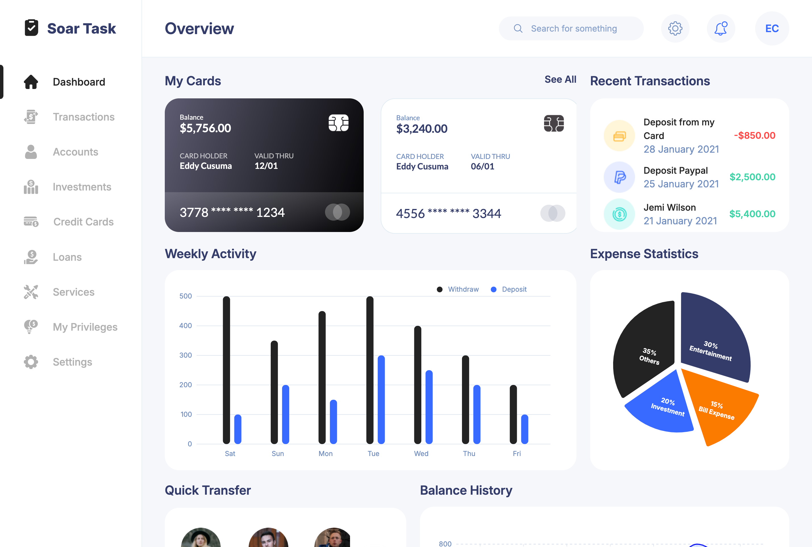
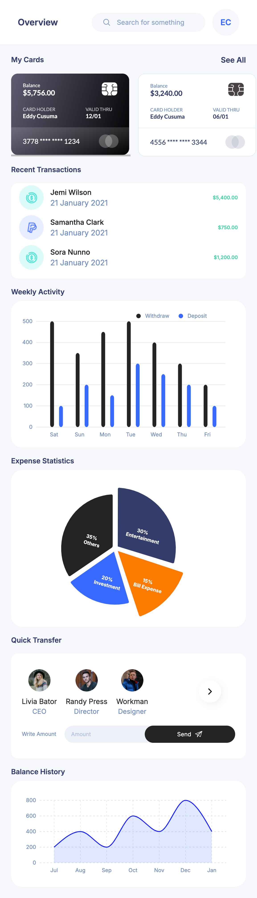
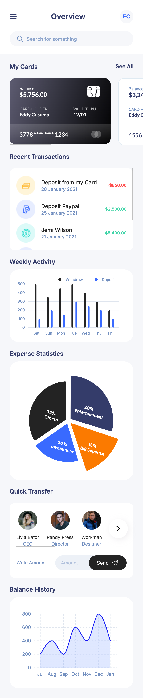

# Soar Task - Modern Banking Dashboard

A modern, responsive banking dashboard built with React and TypeScript. This project demonstrates my ability to create a sophisticated, user-friendly financial interface with real-time data visualization and seamless user interactions.



## 🌐 Live Demo

- [Vercel Deployment](https://soartask2025.vercel.app/)
- [Netlify Deployment](https://soartask.netlify.app/)

## ✨ Features

- **Interactive Dashboard**
  - Real-time balance tracking
  - Credit card management
  - Recent transactions overview
  - Weekly activity visualization
  - Expense statistics with pie chart
  - Quick transfer section
  - Balance history graph

- **Responsive Design**
  - Seamless experience across desktop, tablet, and mobile devices
  - Adaptive layout with optimized viewing on all screen sizes
  - Touch-friendly interface for mobile users

- **Modern UI/UX**
  - Clean and intuitive interface
  - Smooth animations and transitions
  - Dark and light themed cards
  - Real-time data updates

## 🛠️ Tech Stack

- **Frontend Framework**: React 19.0.0
- **Language**: TypeScript
- **Build Tool**: Vite 6.2.0
- **State Management**: Redux Toolkit
- **Routing**: React Router 7.3.0
- **Styling**: Tailwind CSS
- **Data Visualization**: D3.js
- **Form Handling**: Formik with Yup validation
- **Animations**: Framer Motion
- **Notifications**: React Toastify

## 📦 Project Structure

```
soar/
├── src/
│   ├── components/    # Reusable UI components
│   ├── pages/         # Page components
│   ├── layouts/       # Layout components
│   ├── redux/         # Redux store and slices
│   ├── assets/        # Static assets
├── public/
│   └── screenshots/   # Project screenshots
└── db/
    └── balanceHistory.json       # Mock database
    └── cards.json                # Mock database
    └── expenseStatistics.json    # Mock database
    └── savedBeneficiaries.json   # Mock database
    └── user.json                 # Mock database
    └── transactions.json         # Mock database
    └── weeklyActivity.json       # Mock database

```

## 🚀 Getting Started

1. Clone the repository:
   ```bash
   git clone <repository-url>
   ```

2. Install dependencies:
   ```bash
   npm install
   ```

3. Start the development server:
   ```bash
   npm run dev
   ```

## 📱 Mobile Responsiveness

The dashboard is fully responsive with three main breakpoints:
- Mobile: < 768px
- Tablet: 768px - 1280px
- Desktop: > 1280px

## 🔒 Security Features

- Secure password validation
- Protected routes
- Form validation with Yup
- Error handling for API requests

## 🤝 Assessment Context

This project was created to demonstrate:
- Frontend development expertise
- React and TypeScript proficiency
- State management capabilities
- UI/UX design skills
- Code organization and best practices
- Responsive design implementation
- Data visualization abilities

## 📸 Screenshots

<!-- <details>
<summary>Click to view screenshots</summary> -->

### Desktop View


### Tablet View


### Mobile View


</details>

## 📄 License

This project is created for assessment purposes and is not licensed for public use.
